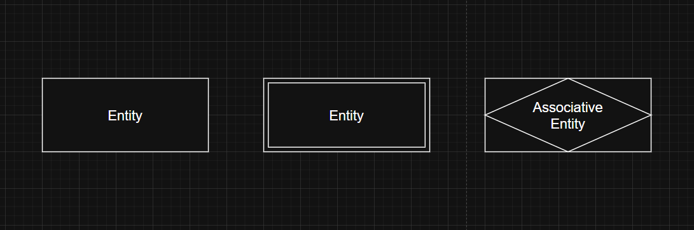
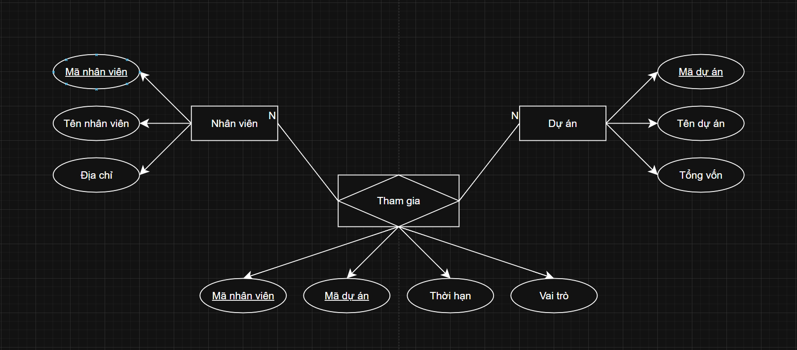
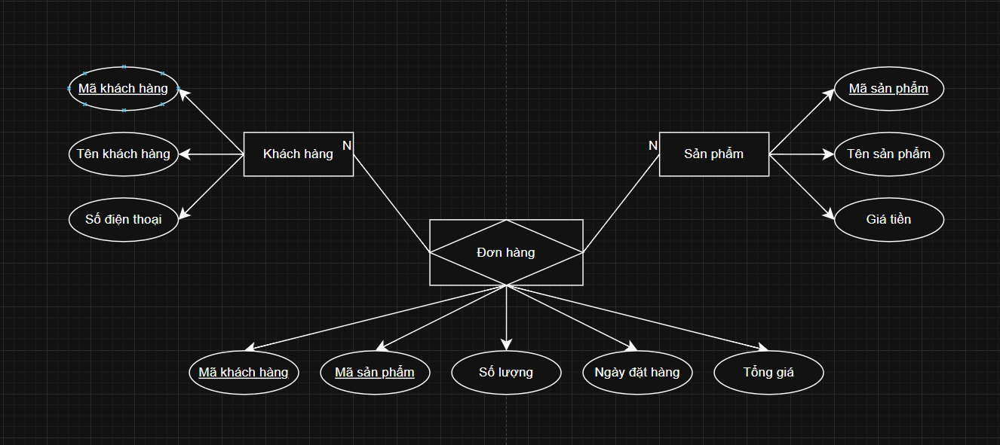

# Thực thể (Entity)

---

## 1. Định nghĩa

- **Thực thể (Entity)** được định nghĩa là `một đối tượng`:
  - Có thể `tồn tại độc lập` và được `nhận diện duy nhất`.
  - Có khả năng `lưu trữ dữ liệu`. 

>Thực thể là sự trừu tượng hóa từ những khía cạnh phức tạp của một miền dữ liệu, đại diện cho một phần của thế giới thực có thể phân biệt được với các phần khác.
 

- Thực thể có thể tồn tại dưới hai dạng:
  - **Vật lý**: Như ngôi nhà, ô tô (các đối tượng tồn tại hữu hình).
  - **Logic**: Như giao dịch khách hàng, đơn hàng (các khái niệm tồn tại dưới dạng trừu tượng).
 

- Mặc dù thuật ngữ "`thực thể`" được sử dụng phổ biến, nhưng cần phân biệt giữa **loại thực thể (entity type)** và **thực thể (entity)**.
  - **Loại thực thể (Entity type)**: Là một danh mục hoặc phân loại.
  - **Thực thể (Entity)**: Là một cá thể cụ thể thuộc loại thực thể đó. Ví dụ: "Nhân viên" là một loại thực thể, còn "Nguyễn Văn A" là một thực thể thuộc loại đó. Thường, người ta sử dụng từ "thực thể" để thay thế cho cả hai do tính tiện dụng.
 

>Thực thể thường được xem như các danh từ. Ví dụ: máy tính, nhân viên, bài hát, hay một định lý toán học.

---

## 2. Phân loại

### 2.1. Thực thể mạnh (Strong Entity)

- Là thực thể có thể `tồn tại độc lập` mà `không cần phụ thuộc` vào bất kỳ thực thể nào khác.
- Thực thể mạnh có **khóa chính (Primary Key)** được `xác định duy nhất` trong tập thực thể của nó.
- Ví dụ: "Nhân viên", "Phòng ban" là các thực thể mạnh vì chúng tồn tại độc lập trong hệ thống.

### 2.2. Thực thể yếu (Weak Entity)

- Là thực thể `không thể tồn tại độc lập` mà `cần phải phụ thuộc` vào một thực thể mạnh khác để tồn tại.
- Thực thể yếu `không có khóa chính riêng` mà thường dựa vào một hoặc nhiều thuộc tính của thực thể mạnh kèm theo một **thuộc tính nhận dạng (Discriminator)** để tạo thành khóa chính.
- Ví dụ: "Hóa đơn chi tiết" phụ thuộc vào "Hóa đơn", hoặc "Người phụ thuộc" phụ thuộc vào "Nhân viên".

### 2.3. Mở rộng: Thực thể liên kết (Associate Entity)

- **Associate Entity (hay còn gọi là "Thực thể liên kết")** thường được sử dụng để `biểu diễn mối quan hệ giữa hai hoặc nhiều thực thể khác` khi mối quan hệ này chứa thêm `các thuộc tính cần được lưu trữ`.

 

- **Vai trò và đặc điểm chính**:
  - **Lưu trữ thông tin bổ sung**: Khi mối quan hệ không chỉ là liên kết đơn giản mà cần lưu thêm dữ liệu bổ sung liên quan đến mối quan hệ đó, Associate Entity sẽ được sử dụng.
  - **Tách mối quan hệ phức tạp**: Associate Entity giúp làm rõ và quản lý tốt hơn mối quan hệ nhiều-nhiều (M:N), vốn không được trực tiếp hỗ trợ trong các hệ quản trị cơ sở dữ liệu quan hệ.
  - **Tạo sự linh hoạt**: Với Associate Entity, bạn có thể dễ dàng mở rộng mô hình khi cần thêm thông tin hoặc thay đổi liên kết giữa các thực thể.

 

- Các **thuộc tính thường có** của Associate Entity:
  - **Khóa chính (Primary Key)**: Thường được tạo thành từ khóa ngoại (Foreign Key) của các thực thể mà nó liên kết. Ngoài ra, có thể bổ sung thêm một thuộc tính định danh riêng nếu cần.
  - **Thuộc tính bổ sung**: Các thông tin liên quan trực tiếp đến mối quan hệ mà các thực thể chính không lưu trữ, ví dụ như "Ngày bắt đầu", "Vai trò", "Trạng thái", v.v.

 

- Ví dụ 1: Quan hệ giữa "Nhân viên" và "Dự án":
  - Associate Entity: "Tham gia Dự án" (biểu diễn thông tin về sự tham gia của nhân viên vào dự án).
  - Thuộc tính của "Tham gia Dự án":
    - Khóa chính: Mã nhân viên (FK), Mã dự án (FK).
    - Thuộc tính bổ sung: "Vai trò", "Thời hạn".
  
  
   

- Ví dụ 2: Quan hệ giữa "Khách hàng" và "Sản phẩm":
  - Associate Entity: "Đơn hàng".
  - Thuộc tính của "Đơn hàng":
    - Khóa chính: Mã khách hàng (FK), Mã sản phẩm (FK).
    - Thuộc tính bổ sung: "Số lượng", "Ngày đặt hàng", "Tổng giá".
  
  
   

>- Khi nào sử dụng Associate Entity:
>   - Khi mối quan hệ cần lưu thêm thông tin bổ sung mà không phù hợp để đặt trong các thực thể gốc.
>   - Khi muốn tối ưu hóa và chuẩn hóa dữ liệu để tránh dư thừa hoặc ràng buộc phức tạp trong bảng.