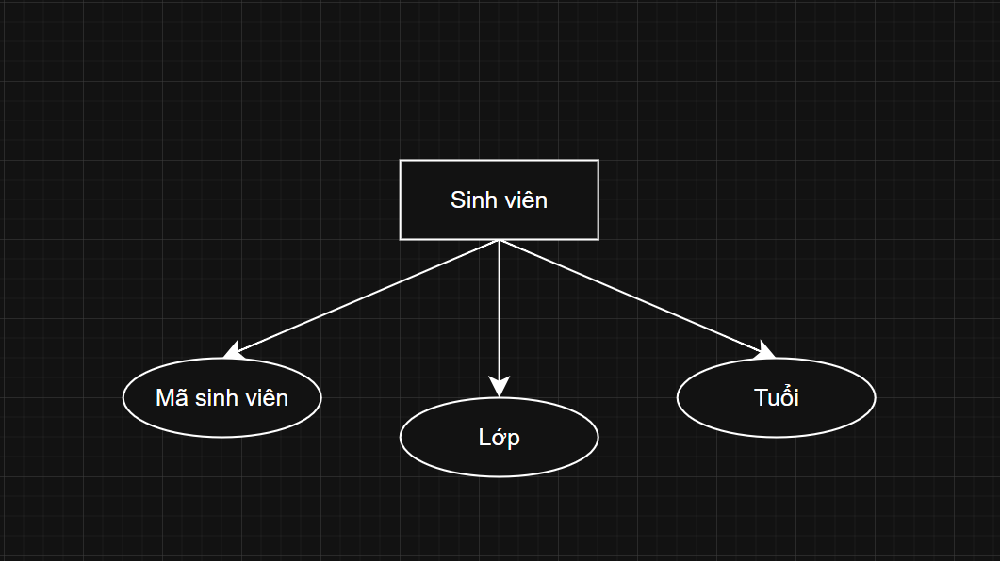
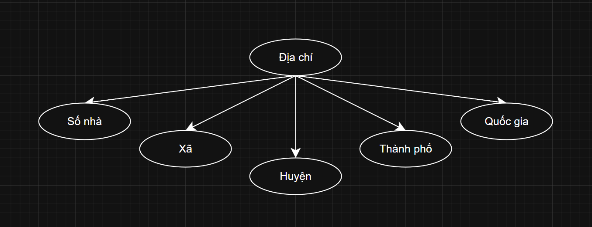
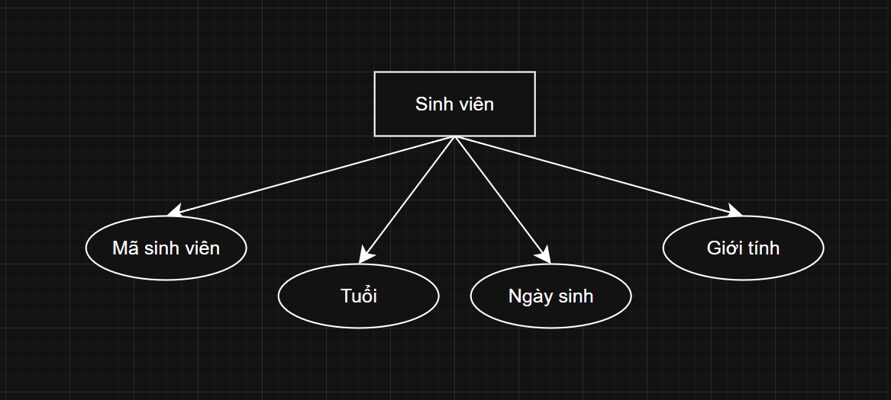
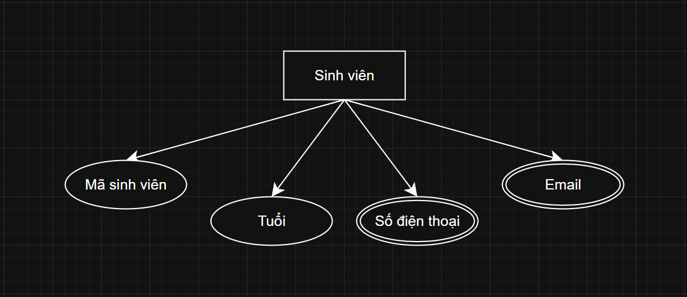
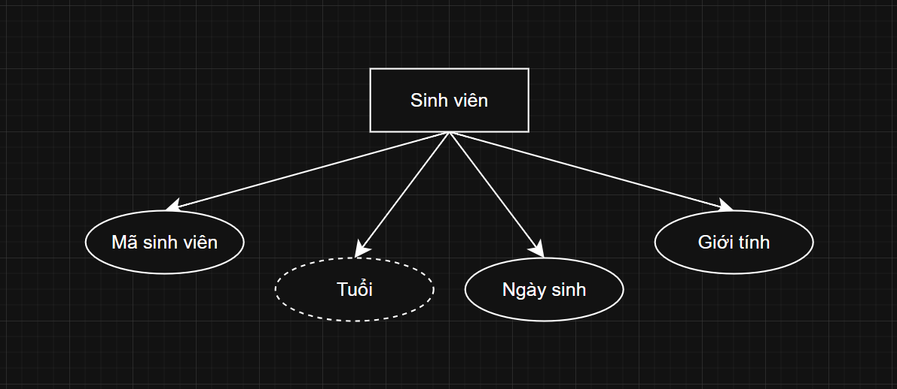
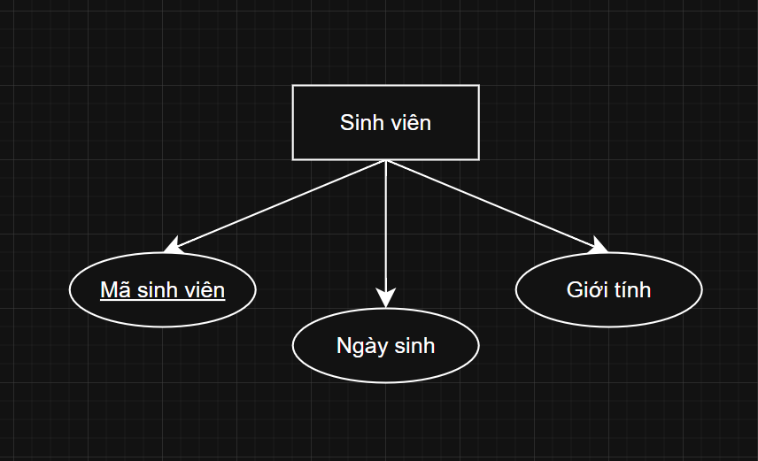
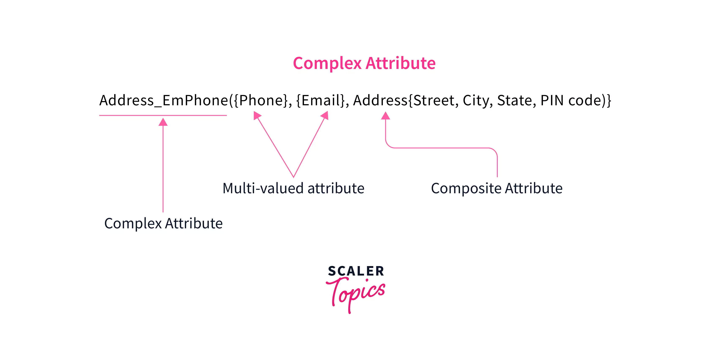
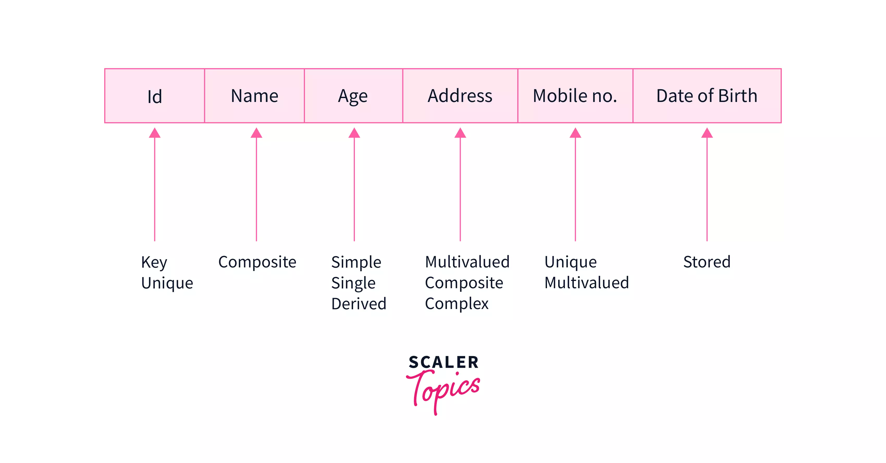

# Thuộc tính (Attribute)

Trong hệ quản trị cơ sở dữ liệu (DBMS), **thực thể** là các đối tượng trong thế giới thực có sự tồn tại độc lập, và chúng được mô tả bằng các **thuộc tính**.

---

## 1. Thuộc tính (Attributes) và Các loại Thuộc tính

### 1.1. Định nghĩa

>**Thuộc tính** giúp định nghĩa đặc điểm, tính chất để mô tả thực thể, tạo cơ sở để xây dựng và quản lý mối quan hệ trong DBMS.

- Mỗi thuộc tính của một thực thể xác định:
  - Có giá trị cụ thể là dữ liệu cần lưu giữ.
  - Có một kiểu dữ liệu xác định.

>Trong mô hình ER, **Thuộc tính** được biểu diễn bằng **hình elip**.

### 1.2. Các loại thuộc tính

[1. **Thuộc tính đơn giản (Simple Attributes)**](#2-thuộc-tính-đơn-giản-simple-attributes)
[2. **Thuộc tính tổng hợp (Composite Attributes)**](#3-thuộc-tính-tổng-hợp-composite-attributes)
[3. **Thuộc tính đơn trị (Single Valued Attributes)**](#4-thuộc-tính-đơn-trị-single-valued-attributes)
[4. **Thuộc tính đa trị (Multi-Valued Attributes)**](#5-thuộc-tính-đa-trị-multi-valued-attributes)
[5. **Thuộc tính dẫn xuất (Derived Attributes)**](#6-thuộc-tính-dẫn-xuất-derived-attributes)
[6. **Thuộc tính phức hợp (Complex Attributes)**](#8-thuộc-tính-phức-hợp-complex-attributes)
[7. **Thuộc tính khóa (Key Attributes)**](#7-thuộc-tính-khóa-key-attributes)
[8. **Thuộc tính lưu trữ (Stored Attributes)**](#9-thuộc-tính-lưu-trữ-stored-attributes)

---

## 2. Thuộc tính đơn giản (Simple Attributes)

>**Thuộc tính đơn giản** trong mô hình ER là các thuộc tính độc lập, `không thể phân chia` hay `tách nhỏ` thành các thành phần con. Chúng còn được gọi là **thuộc tính nguyên tử (atomic attributes)**.

 

- **Ví dụ**: Thực thể "Sinh viên" được biểu diễn bằng hình chữ nhật, gồm có các thuộc tính:
  - Mã sinh viên.
  - Lớp.
  - Tuổi.

>Các thuộc tính này không thể chia nhỏ hơn được nữa (ví dụ `Mã sinh viên` không thể tách thành các thuộc tính con). Do đó, chúng được xem là **thuộc tính đơn giản** của thực thể "Sinh viên".

---

## 3. Thuộc tính tổng hợp (Composite Attributes)

>**Thuộc tính tổng hợp** có chức năng **trái ngược** với **thuộc tính đơn giản**, vì chúng có thể được **chia nhỏ** thành các thành phần hoặc thuộc tính con đơn giản hơn. Nói cách khác, thuộc tính tổng hợp được **tạo thành từ một hoặc nhiều** thuộc tính đơn giản.

 

- **Ví dụ**: Thuộc tính "Địa chỉ" được biểu diễn bằng hình elip và có thể chia thành các thuộc tính con như:
  - Số nhà.
  - Xã.
  - Huyện.
  - Thành phố.
  - Quốc gia.

>Điều này cho thấy **Địa chỉ** là một **thuộc tính tổng hợp**, vì nó bao gồm nhiều thành phần thuộc tính đơn giản hơn.

---

## 4. Thuộc tính đơn trị (Single-Valued Attributes)

>**Thuộc tính đơn trị** là những thuộc tính chỉ chứa **một giá trị duy nhất** cho mỗi thực thể và không thể lưu trữ nhiều hơn một giá trị. Giá trị của thuộc tính đơn trị luôn cố định, ví dụ như tên của một người.

 

- **Ví dụ**: Thực thể "Sinh viên" được biểu diễn bằng hình chữ nhật, gồm có các thuộc tính:
  - Mã sinh viên. (Là duy nhất cho mỗi sinh viên)
  - Tuổi.
  - Ngày sinh. (Chỉ có một ngày sinh duy nhất, từ đó có thể tính Tuổi)
  - Giới tính. (Cố định cho mỗi thực thể) 

>Vì không thể chia nhỏ và chỉ chứa một giá trị duy nhất, các thuộc tính này được coi là **đơn trị** và đồng thời cũng là **thuộc tính đơn giản**.

---

## 5. Thuộc tính đa trị (Multi-Valued Attributes)

>**Thuộc tính đa trị** là những thuộc tính có thể **chứa và lưu trữ nhiều giá trị cùng lúc** cho một thực thể, thay vì chỉ một giá trị duy nhất như thuộc tính đơn trị. Các thuộc tính này thường được biểu diễn bằng **hình elip đồng tâm** hoặc sử dụng **dấu ngoặc nhọn { }** để biểu thị.

 

- **Ví dụ**: Thực thể "Sinh viên" được biểu diễn bằng hình chữ nhật, gồm có các thuộc tính:
  - Mã sinh viên. (Thuộc tính đơn trị)
  - Tuổi. (Thuộc tính đơn trị)
  - Số điện thoại. (Có thể có nhiều số điện thoại)
  - Email. (Có thể có nhiều địa chỉ email) 

>Các **thuộc tính đa trị** rất hữu ích khi cần **lưu trữ thông tin mở rộng** và **không giới hạn số lượng giá trị** cho một thực thể.

---

## 6. Thuộc tính dẫn xuất (Derived Attributes)

>**Thuộc tính dẫn xuất** là những thuộc tính mà giá trị của chúng có thể **được tính toán hoặc suy ra** từ giá trị của **các thuộc tính khác**. Do đó, các thuộc tính này luôn **phụ thuộc** vào các thuộc tính khác để xác định giá trị của mình và được biểu diễn bằng **hình elip nét đứt**.

 

- **Ví dụ**: Thực thể "Sinh viên" được biểu diễn bằng hình chữ nhật, gồm có các thuộc tính:
  - Mã sinh viên. 
  - Tuổi. (Sẽ thay đổi theo thời gian và có thể dễ dàng tính toán từ Ngày sinh)
  - Ngày sinh. (Là thuộc tính đơn trị và có thể tính ra Tuổi)
  - Giới tính. 

>Trong trường hợp này, Tuổi là một thuộc tính dẫn xuất từ thuộc tính Ngày sinh.

---

## 7. Thuộc tính khóa (Key Attributes)

>**Thuộc tính khóa** là loại **thuộc tính đặc biệt** được sử dụng làm **khóa chính (primary key)** của một thực thể. Thuộc tính này có khả năng **duy nhất để nhận dạng** một thực thể trong tập thực thể. Các giá trị của thuộc tính khóa phải **không trùng lặp** và **không thay đổi** và được biểu diễn bằng **hình elip có gạch chân**.

 

- **Ví dụ**: Thực thể "Sinh viên" được biểu diễn bằng hình chữ nhật, gồm có các thuộc tính:
  - Mã sinh viên. (Luôn duy nhất cho mỗi sinh viên, giúp nhận diện sinh viên một cách rõ ràng)
  - Ngày sinh. (Có thể trùng lặp giữa các Sinh viên)
  - Giới tính. (Có thể trùng lặp giữa các Sinh viên)

>Thuộc tính Mã sinh viên của thực thể Student không chỉ là **thuộc tính đơn giản và đơn trị**, mà còn là một **thuộc tính khóa**.

---

## 8. Thuộc tính phức hợp (Complex Attributes)

>**Thuộc tính phức hợp** là sự kết hợp giữa **thuộc tính đa trị** và **thuộc tính tổng hợp**. Thuộc tính này thường hiếm khi được sử dụng trong DBMS và bao gồm nhiều phần nhỏ trong giá trị của nó.

 

- **Ví dụ**:
  - Address_EmPhone (bao gồm Địa chỉ, Email và Số điện thoại) là một thuộc tính phức hợp.
    - Email và Số điện thoại là các thuộc tính đa trị.
    - Address là thuộc tính tổng hợp, được chia thành các phần như Số nhà, Đường, Thành phố và Bang.
  - Sự kết hợp giữa các thuộc tính đa trị và tổng hợp này tạo thành một thuộc tính phức hợp.

---

## 9. Thuộc tính lưu trữ (Stored Attributes)

>**Thuộc tính lưu trữ** là các thuộc tính **có giá trị cố định** và **không thay đổi** trong suốt vòng đời của thực thể. Chúng thường được sử dụng để **tính toán các thuộc tính dẫn xuất**.

- **Ví dụ**:
  - Ngày sinh (Date of Birth) là một thuộc tính lưu trữ, có giá trị cố định và không thay đổi.
  - Từ Ngày sinh, chúng ta có thể tính được thuộc tính dẫn xuất như Tuổi.

