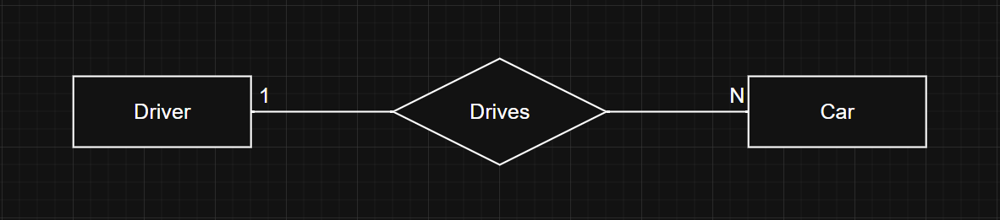
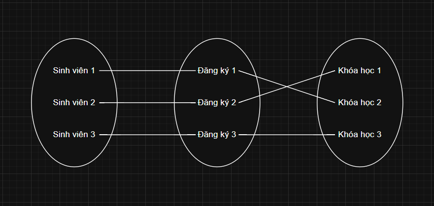
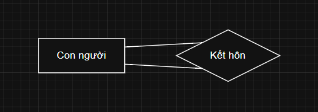
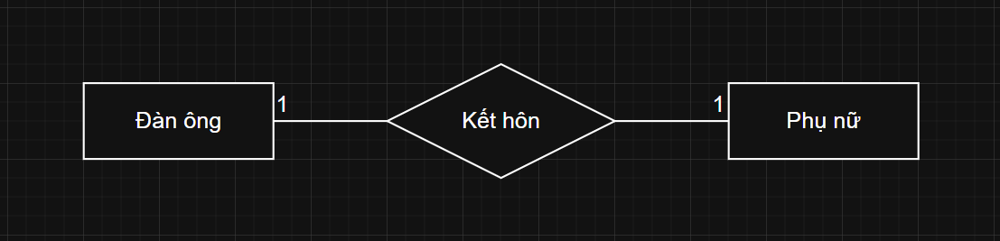
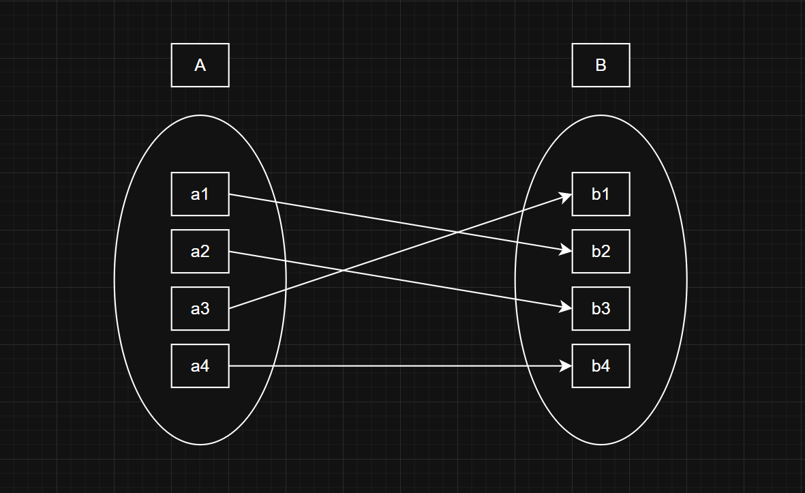
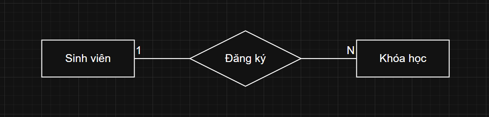
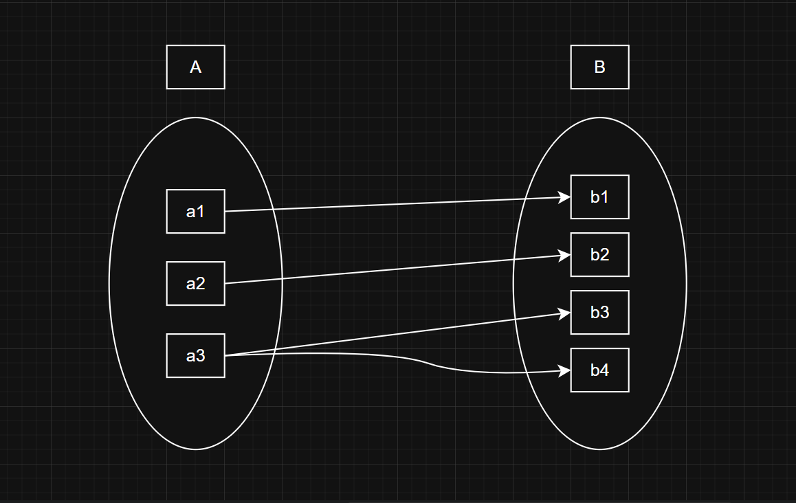

# Mối quan hệ hay Liên kết (Relationships)

---

## 1. Loại quan hệ (Relationship Type) và Tập quan hệ (Relationship Set)

> **Loại quan hệ (Relationship Type)** biểu diễn sự liên kết giữa các loại thực thể (Entity Types).

- Trong sơ đồ ER, loại quan hệ được biểu diễn bằng **hình thoi**, và các thực thể được kết nối với nó bằng các đường thẳng.

**Ví dụ**: Quan hệ "Drives" biểu diễn mối quan hệ giữa loại thực thể "Driver" và "Car".

> **Tập quan hệ (Relationship Set)** là tập hợp các quan hệ cùng loại, chứa các mối liên kết cụ thể giữa các thực thể.

**Ví dụ**: Tập quan hệ "Đăng ký" có thể bao gồm:

- "Sinh viên 1" đăng ký vào "Khóa học 2".
- "Sinh viên 2" đăng ký vào "Khóa học 1".
- "Sinh viên 3" đăng ký vào "Khóa học 3".

> **Chú ý**:
>
> - **Loại quan hệ** là khái niệm chung, dùng để biểu diễn mối liên kết giữa các loại thực thể.
> - **Tập quan hệ** là tập hợp các trường hợp cụ thể (instances) của loại quan hệ, biểu diễn mối liên kết giữa các thực thể cụ thể.

## 2. Bậc của một tập quan hệ (Degree of a Relationship Set)

> **Bậc của một tập quan hệ** biểu thị **số lượng** các tập thực thể tham gia vào **một tập quan hệ**.

### 2.1. Quan hệ đơn ngôi (Unary Relationship)

> Khi chỉ có **một tập thực thể** tham gia vào một quan hệ, quan hệ này được gọi là **quan hệ đơn ngôi**.

- **Ví dụ**: Quan hệ "Kết hôn" giữa một người với một người khác. Trong trường hợp này, chỉ có một tập thực thể "Con người" tham gia vào quan hệ "Kết hôn".

### 2.2. Quan hệ nhị ngôi (Binary Relationship)

> Khi có **hai tập thực thể** tham gia vào một quan hệ, quan hệ này được gọi là **quan hệ nhị ngôi**.

- **Ví dụ**: Quan hệ "Drives" giữa "Driver" và "Car". Trong quan hệ này, "Driver" lái một "Car".

### 2.3. Quan hệ tam ngôi (Ternary Relationship)

> Khi có **ba tập thực thể** tham gia vào một quan hệ, quan hệ này được gọi là **quan hệ tam ngôi**.

- **Ví dụ**: Quan hệ "Cung cấp" giữa "Nhà cung cấp", "Sản phẩm", và "Khách hàng". Trong mối quan hệ này "Nhà cung cấp" cung cấp "Sản phẩm" cho "Khách hàng".

### 2.4. Quan hệ n-ngôi (N-ary Relationship)

> Khi có **n tập thực thể** tham gia vào một quan hệ, quan hệ này được gọi là **quan hệ n-ngôi**.

- **Ví dụ**:
  - Quan hệ giữa "Dự án", "Nhân viên", "Thời gian", và "Vị trí".
  - Trong ví dụ này, mỗi dự án liên quan đến một nhóm nhân viên làm việc trong một khoảng thời gian cụ thể tại một vị trí cụ thể.

> **Chú ý**:
>
> - Các **mối quan hệ nhị ngôi** là **phổ biến nhất** trong các hệ thống cơ sở dữ liệu.
> - Quan hệ tam ngôi và n-ngôi thường phức tạp hơn và chỉ xuất hiện khi cần biểu diễn các tương tác đa chiều giữa nhiều tập thực thể.

---

## 3. Ràng buộc Lực lượng ánh xạ (Mapping Cardinality Constraints)

>**Ràng buộc lực lượng ánh xạ** được sử dụng để **diễn tả số lượng thực thể** có thể được **liên kết** với một **thực thể khác** thông qua một **tập hợp quan hệ**. Đây là một khái niệm quan trọng, đặc biệt trong việc mô tả các tập hợp quan hệ nhị phân.

Đối với một tập hợp quan hệ nhị phân, lực lượng ánh xạ phải thuộc một trong các loại sau:

### 3.1. One-to-One (1-1)

>Mỗi thực thể trong tập hợp thứ nhất có thể **liên kết tối đa với một** thực thể duy nhất trong tập hợp thứ hai **và ngược lại**.

Biểu diễn trong Tập hợp, có thể thấy như hình bên dưới:

### 3.2. One-to-Many (1-N)

>Mỗi thực thể trong tập hợp thứ nhất có thể **liên kết với nhiều** thực thể trong tập hợp thứ hai, nhưng mỗi thực thể trong tập hợp thứ hai **chỉ liên kết với một** thực thể duy nhất trong tập hợp thứ nhất.

Biểu diễn trong Tập hợp, có thể thấy như hình bên dưới:

### 3.3. Many-to-One (N-1)

Nhiều thực thể trong tập hợp thứ nhất có thể liên kết với cùng một thực thể trong tập hợp thứ hai, nhưng mỗi thực thể trong tập hợp thứ hai chỉ liên kết với một thực thể duy nhất trong tập hợp thứ nhất.

### 3.4. Many-to-Many (N-N)

Nhiều thực thể trong tập hợp thứ nhất có thể liên kết với nhiều thực thể trong tập hợp thứ hai và ngược lại.

---

## 4. Ràng buộc Tham gia (Participation Constraint)

>**Ràng buộc tham gia** được áp dụng cho các thực thể tham gia vào một tập hợp quan hệ, nhằm xác định mức độ tham gia của chúng. Có hai loại ràng buộc tham gia chính:

### 4.1. Tham gia toàn phần (Total Participation):

- Mỗi thực thể trong tập thực thể bắt buộc phải tham gia vào tập hợp quan hệ.
- Ví dụ: Nếu mỗi sinh viên đều phải đăng ký ít nhất một khóa học, thì sự tham gia của thực thể Sinh viên trong quan hệ "Đăng ký" sẽ là tham gia toàn phần.
- Trong sơ đồ ER, tham gia toàn phần được biểu diễn bằng đường đôi kết nối giữa thực thể và quan hệ.

### 4.2. Tham gia một phần (Partial Participation):

- Một thực thể trong tập thực thể có thể hoặc không tham gia vào tập hợp quan hệ.
- Ví dụ: Nếu có một số khóa học không được bất kỳ sinh viên nào đăng ký, thì sự tham gia của thực thể Khóa học trong quan hệ "Đăng ký" sẽ là tham gia một phần.
- Trong sơ đồ ER, tham gia một phần được biểu diễn bằng đường đơn kết nối giữa thực thể và quan hệ.

### 4.3. Ví dụ minh họa

